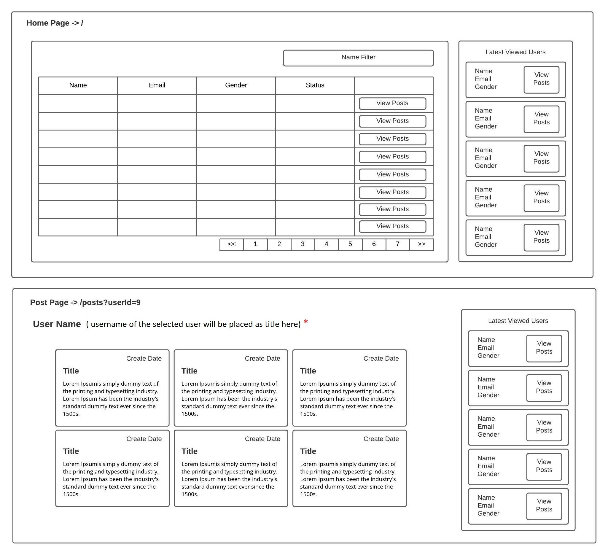

# Angular Blog App

## Template

## Todos
* Prepare two pages (as visualized in the attachment)
    * A page which consists a paginated table of Users with a “Name” search filter
in the route : Base url (main route / )
    * A page which shows posts of a specific user in the route :
/posts?userld—(user id)
* Place a digital clock (with a format of 29/09/2020 17:13:15) on a small header on top
of the page, and make it work continuously
* Put the “latest viewed users” component on the right hand side, as a steady
component which will always be visible.

## Development Rules

* Use Angular12 (latest version).

* Use ngx-bootstrap for creating table with pagination, and Bootstrap cards (if needed).
https://valor-software.com/ngx-bootstrap

* Speaking of tabular data, server-side requests must involve a combined version of
the name filter and the current page number, requiring the usage of RxJS library
when fetching data. As the api dictates, set rows per page count to 20, as hardcoded.

* Current page number and the name filter input will be presented as data streams,
use behavior subjects for triggering changes on the fetch api.

* Latest viewed users component must make use of ngRx (Reactive State for Angular)
library when saving the latest viewed users, and will always be available on the right
sidebar. Inner part of this component must accumulate as the user visits different
(distinct) user posts. It is very important that the store will always have 5 users, rather
than piling up all the visited users.

* Create date on the posts page, needs to be formatted as (dd/mm/yyyy hh:mm) using
MomentJS.

* Username will be presented as a title on the user posts page.

## API Information and Example Requests:

##### Fetching user list: https://gorest.co.in/public-api/users

##### User list with pagination and filtering: https://gorest.co.in/public-api/users?name=varma&page=2

##### Fetching user posts: https://gorest.co.in/public-api/users/:userld/posts
